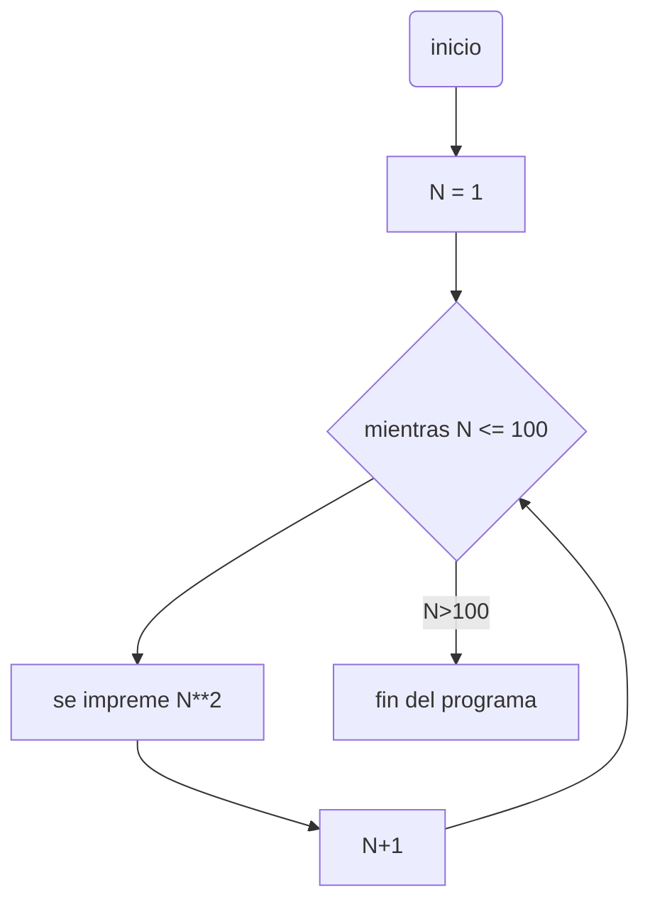
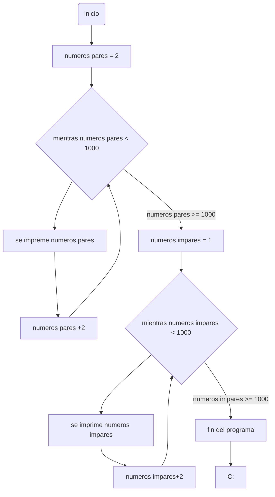
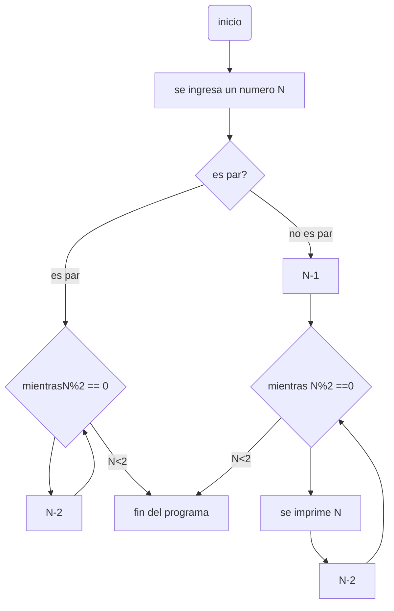

<div align='center'>
<figure> </br>
<figcaption><b></b></figcaption></figure>
</div>

# repo_reto_7

1. Imprimir un listado con los números del 1 al 100 cada uno con su respectivo cuadrado.
________________________________
```python
#Imprimir un listado con los números del 1 al 100 cada uno con su respectivo cuadrado

def cuadrados(lista : int) -> int:
    return lista ** 2

if __name__ == "__main__":
    lista : int = 1
    while lista <= 100:
        print("cuadrado del:",lista,cuadrados(lista))
        lista += 1
    print("Fin del while loop")
```

2.  Imprimir un listado con los números impares desde 1 hasta 999 y seguidamente otro listado con los números pares desde 2 hasta 1000.
________________________________
```python
#Imprimir un listado con los números impares desde 1 hasta 999 y seguidamente otro listado con los números pares desde 2 hasta 1000

if __name__ == "__main__":
    pares : int = 2
    impares : int = 1

    while pares <= 1000:
        print("pares:",pares)
        pares += 2
    print("Fin del while loop pares")

    while impares <= 1000 and impares % 2 != 0:
        print("impares:",impares)
        impares += 2
    print("Fin del while loop impares")
```

3.  Imprimir los números pares en forma descendente hasta 2 que son menores o iguales a un número natural n ≥ 2 dado
________________________________
```python
#Imprimir los números pares en forma descendente hasta 2 que son menores o iguales a un número natural n ≥ 2 dado

if __name__ == "__main__":    
    numeroN = int(input("Ingrese un número: "))
    if numeroN % 2 == 0:
        while numeroN >= 2 and numeroN % 2 == 0:
            print(numeroN)
            numeroN -= 2
    else:
        numeroN -= 1
        while numeroN >= 2 and numeroN % 2 == 0:
            print(numeroN)
            numeroN -= 2

```


4. En 2022 el país A tendrá una población de 25 millones de habitantes y el país B de 18.9 millones. Las tasas de crecimiento anual de la población serán de 2% y 3% respectivamente. Desarrollar un algoritmo para informar en que año la población del país B superará a
la de A.
________________________________
```python
#En 2022 el país A tendrá una población de 25 millones de habitantes y el país B de 18.9 millones. 
#Las tasas de crecimiento anual de la población serán de 2% y 3% respectivamente. 
#Desarrollar un algoritmo para informar en que año la población del país B superará a la de A.

if __name__ == "__main__":
    pais_A_poblacion : float = 22000000
    pais_B_poblacion : float = 18900000
    tasa_crecimiento_pais_A : float = 0.02
    tasa_crecimiento_pais_B : float = 0.03
    tiempo : int = 0
    while pais_B_poblacion < pais_A_poblacion:
        pais_A_poblacion = pais_A_poblacion * (1 + tasa_crecimiento_pais_A) ** tiempo
        pais_B_poblacion = pais_B_poblacion * (1 + tasa_crecimiento_pais_B) ** tiempo
        tiempo += 1
    print("desdes el 2022 La población de B supero a la poblacion de A en", tiempo, "años")
    print("Población de A:", pais_A_poblacion)
    print("Población de B:", pais_B_poblacion)
```
5. Imprimir el factorial de un número natural n dado.
________________________________
```python
if __name__ == "__main__":
    numeroN = int(input("Ingrese un numero entero positivo: "))
    factorial = 1

    while numeroN > 0:
        factorial *= numeroN
        numeroN -= 1
    print("El resultado del factorial es: ", factorial)
```
6. Implementar un algoritmo que permita adivinar un número dado de 1 a 100, preguntando en cada caso si el número es mayor, menor o igual.
________________________________
```python
if __name__ == "__main__":
    print("este programa adivinada el numero que estas pensando")
    print("Piensa en un numero entero entre 1 y 100")
    print("El programa intentara adivinar el numero que estas pensando")
    print("Si el numero que el programa te da es mayor que el tuyo escribe 'M'")
    print("Si el numero que el programa te da es menor que el tuyo escribe 'm'")
    print("Si el numero que el programa te da es el correcto escribe 'OK'")
    print("en un punto te preguntara mas informacion que se respondera de manera diferente")
    
    while True:
        minimo = 1
        maximo = 100
        while True:
            numero = (minimo + maximo) // 2
            print("Estas pensando en el numero", numero, "?")
            respuesta = input("Escribe 'M', 'm' o 'OK': ")
            if respuesta == "OK":
                print("El programa ha adivinado el numero que estabas pensando")
                break
            elif respuesta == "m":
                maximo = numero - 1
            elif respuesta == "M":
                minimo = numero + 1
            elif respuesta == "salir":
                break
            else:
                print("ingrese solo las letras establecidas")
        
```
7. Implementar un programa que ingrese un número de 2 a 50 y muestre sus divisores.
________________________________
```python
def divisores (numeroN,divisor)->float:
    if numeroN % divisor == 0:
        return True 
    else:
        return False
    
if __name__ == "__main__":
    numeroN = int(input("Ingrese un numero entero positivo(numero entre 2 y 50): "))
    if numeroN < 2 or numeroN > 50:
        print("El numero ingresado no es valido")
    else:
        divisor = 2
        while divisor <= numeroN and numeroN < 50:
            if divisores(numeroN,divisor):
                print(divisor)
            divisor += 1 
        print("Fin del ejercicio 7 reto 8 ")
```
8. Implementar el algoritmo que muestre los números primos del 1 al 100. **Nota:** use funciones
________________________________
```python
def es_primo (numero):
  conteo=2
  divisores=1
  while conteo<=numero and divisores <=2:
    comprobacionSiEsDivisor = numero % conteo
    if comprobacionSiEsDivisor == 0:
      divisores=divisores+1
    conteo=conteo+1
  if divisores == 3:
    return False
  else: 
    return True
  
if __name__ == "__main__":
    numero=0
while numero<=100:
  if es_primo(numero):
    print(numero)
  numero=numero+1
print("Fin del ejercicio 8 reto 7 ")
```
